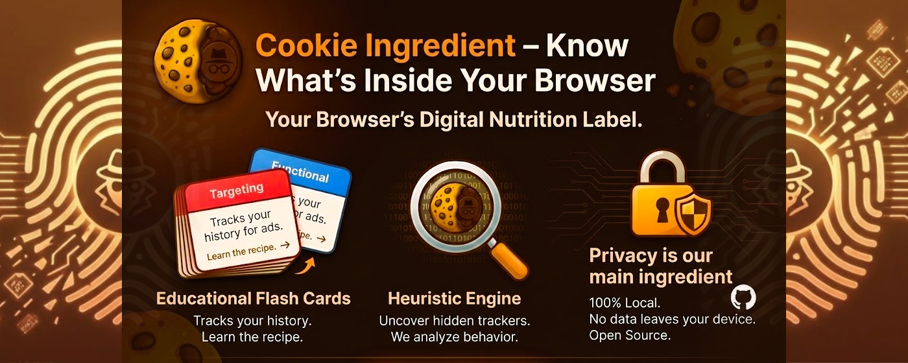

# Cookie Ingredient

A free, open-source Chrome Extension that works like a nutritional label for websites. It breaks down the cookies and storage data baked into every page you visit — who set them, what they do, and how much you should care.

### [Get it on the Chrome Web Store](https://chromewebstore.google.com/detail/cookie-ingredient/kpnieliibkbfnknhdnnkmcanclhnklcp)

---

## What's new in v2

v2 is a ground-up rework of the popup UI and extension internals:

- **Tab navigation** — Overview, Cookies, and Storage live in their own panels instead of one long scroll. The tab bar is a segmented pill control.
- **Privacy Score gauge** — A semicircle gauge scores the current page 0–100 based on a weighted formula: targeting cookies hit hard (`×8`), performance cookies nudge it (`×3`), and strictly necessary cookies pull it back down. The label shifts from "Low Risk" through "Moderate" and "Elevated" to "High Risk."
- **Flip cards** — The four category cards on the Overview tab now actually flip on click (yes, the CSS was there in v1 but nobody wired up the JS — classic).
- **Storage inspector** — A content script (`content.ts`) now enumerates `localStorage` and `sessionStorage` on the active page. Items are grouped into collapsible sections with item counts. You can nuke it all with a confirmation modal.
- **Per-site cookie protection** — Lock icon toggles `protect_<hostname>` in `chrome.storage.local`. While protected, the "Clear All Cookies" button is disabled.
- **Filter chips** — Pill-shaped category filters in the Cookies tab with active-state coloring per category. They wrap naturally so nothing hides off-screen.
- **Dark mode persistence** — Theme preference saves to `chrome.storage.local` and restores on popup open.
- **CSS overhaul** — Borders replaced with subtle shadows, tighter spacing, Inter/system-ui font stack, gradient buttons, 6px scrollbars. Every style has a dark mode counterpart.

---

## How it works

### The identification engine

When you open the popup, it calls `chrome.cookies.getAll()` for the active tab and runs each cookie through a 4-step pipeline in `identifyCookie()`:

1. **Exact match** — O(1) `Map` lookup against ~3,000 known cookie names from the [Open Cookie Database](https://github.com/jkwakman/Open-Cookie-Database).
2. **Pattern match** — Regex array for wildcard cookies (e.g., `_ga_*`, `_hj*`).
3. **Heuristic analysis** — If the cookie isn't in the database, we guess. `HttpOnly` + short lifespan = probably a session token (Strictly Necessary). Third-party domain + long expiry = probably a tracker (Targeting). Lifespan > 1 year = almost certainly profiling you.
4. **Fallback** — Anything that doesn't match gets bucketed as Functional with a disclaimer.

### The 4 categories

| Category | What it means | Badge color |
|---|---|---|
| **Strictly Necessary** | Login sessions, CSRF tokens, shopping carts. The site breaks without these. | Green |
| **Functional** | Language preferences, dark mode, region settings. Useful, not creepy. | Blue |
| **Performance** | Analytics and load-time metrics. Usually anonymous, sometimes not. | Purple |
| **Targeting** | Ad pixels, cross-site trackers, retargeting. The reason you see shoe ads everywhere. | Rose |

This maps to GDPR/CCPA consent categories, so the labels should feel familiar.

### Risk scoring

```
raw = (targeting × 8) + (performance × 3) + (functional × 1) - (necessary × 0.5)
score = clamp(0, 100, floor(raw))
```

The weighting is opinionated — targeting cookies are penalized heavily because they're the ones building a profile of you across the web. Necessary cookies get a small negative weight because a site that's mostly session tokens is probably fine.

### Storage inspector

`content.ts` is injected on every page via `manifest.json`. It listens for two messages from the popup:

- `GET_STORAGE_INFO` — Enumerates both storage APIs, returns key names and byte sizes.
- `CLEAR_STORAGE` — Wipes localStorage, sessionStorage, or both. The popup shows a confirmation modal first (you *will* get logged out).

---

## Build

```bash
npm run build    # Vite bundles popup + content script, then tsc compiles content.ts separately
npm run zip      # Build + zip dist/ for Chrome Web Store upload
```

The two-stage build exists because the popup and content script have fundamentally different runtime contexts. Vite bundles the popup (with CSS and the large `cookies.json` dataset). `tsc` separately compiles `content.ts` because it's injected by Chrome into page context, not imported by the popup.

Output lands in `dist/` with paths matching what `manifest.json` expects: `src/popup/popup.js`, `src/content/content.js`.

No tests or linting configured yet. PRs welcome.

---

## Project structure

```
src/
  popup/
    popup.html       # Extension popup markup — tabs, gauge SVG, flip cards, modals
    popup.ts         # Main entry — cookie fetching, gauge rendering, storage rendering, event wiring
    popup.css        # All styles, light + dark mode
    ui.ts            # UI helpers — theme toggle, tab switching, flip cards, storage section toggles, modals
    helper.ts        # getElement() null-safe utility
  content/
    content.ts       # Content script — localStorage/sessionStorage enumeration + clearing
  cookie_lookup/
    cookies.json     # Open Cookie Database dataset (~3,000 entries)
    identifyCookie.ts  # 4-step identification pipeline
    cookietypes.ts   # Category enum
    riskScore.ts     # Weighted risk scoring formula
public/
  manifest.json      # Manifest V3 — permissions: cookies, tabs, storage, activeTab
  icons/             # Extension icons
```

---

## Deployment

GitHub Actions (`.github/workflows/deploy.yml`) triggers on `v*` tags. It builds, zips, and uploads to the Chrome Web Store as a draft using repository secrets (`CLIENT_ID`, `CLIENT_SECRET`, `REFRESH_TOKEN`, `EXTENSION_ID`).

---

## Built with help from AI

Transparency matters — this project has been built with AI assistance across both major versions:

- **v1** was developed with **Gemini 2.5 Pro** via the Gemini web app, which helped with the initial Vite + TypeScript architecture, the heuristic classification algorithms, and converting the cookie database into efficient `Map` lookups.
- **v2** was developed with **Claude Opus 4.6** via [Claude Code](https://claude.ai/code) (Anthropic's CLI tool), which contributed the tab navigation system, risk score gauge, storage inspector, flip card wiring, collapsible storage sections, filter chip active states, and the full CSS overhaul.

Both AIs acted as pair programmers. All code was reviewed, tested, and shipped by a human.

---

## Acknowledgements

Huge thanks to the **[Open Cookie Database](https://github.com/jkwakman/Open-Cookie-Database)** project. Their community-maintained JSON dataset powers the exact-match and pattern-match layers of the identification engine. Without it, we'd be guessing a lot more.

*Cookie data license: Apache License 2.0*

## License

MIT License. See `LICENSE` for details.
